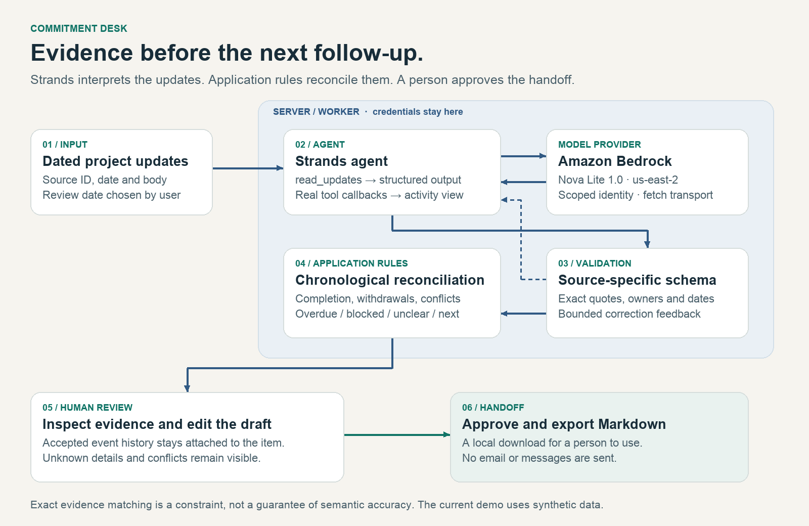
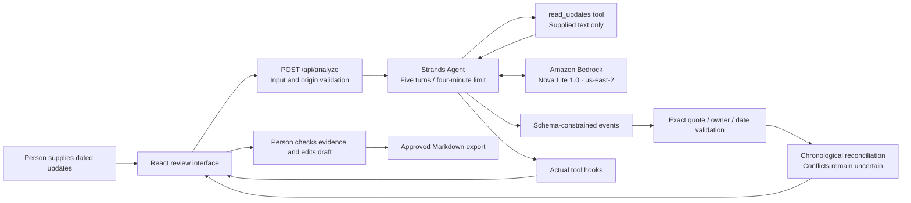

# Architecture

The standalone SVG and PNG are suitable for the entry upload. The hosted configuration below uses Bedrock; Ollama is an optional, unverified development path.

The language model interprets text; ordinary code applies dates, evidence checks, conflict rules and follow-up templates. No outbound communication is permitted by the tool set. The human approval button approves a local handoff draft only.

Source text crosses a model trust boundary and is treated as untrusted data. Exact matching verifies that the passage exists, not that every extracted interpretation is true. The interface retains all accepted event evidence and surfaces rejected extractions. Model settings stay on the server.

The configured provider is Amazon Nova Lite 1.0 in us-east-2. Server code uses native Converse tools, a Worker-compatible fetch transport, and Sites secrets for a dedicated identity scoped to this model. Exact-evidence validation returns tool feedback for bounded model correction before chronological reconciliation. AgentCore is not used.
